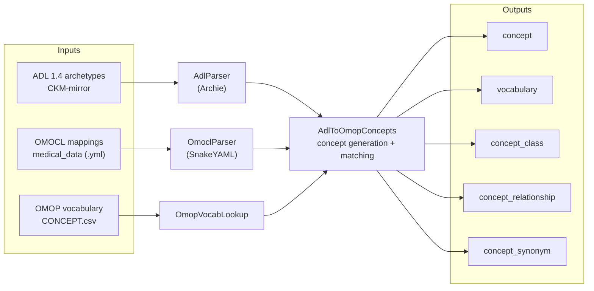
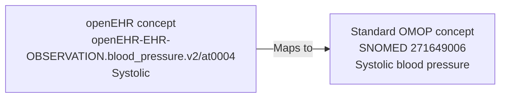

# openEHROMOPVocab

Generates [OMOP CDM](https://ohdsi.github.io/CommonDataModel/) vocabulary files — SQL `INSERT` scripts and tab-separated CSVs — from [openEHR](https://openehr.org/) ADL 1.4 archetypes and [OMOCL](https://github.com/OMOCL/medical_data) mapping files.

The tool creates a new OMOP vocabulary, `openEHR`, with one concept per archetype term (`at` code), and links those concepts to standard OMOP concepts through `Maps to` relationships taken from OMOCL. This makes openEHR data queryable in OMOP/OHDSI without replacing the standard vocabularies.

## Pipeline



Each OMOCL mapping becomes a `Maps to` relationship from a generated openEHR concept to a standard OMOP concept:



## How the vocabulary is built

| Table | Content |
|---|---|
| `VOCABULARY` | One row: `openEHR` — "openEHR Archetype Terms", referencing the CKM-mirror repository |
| `CONCEPT_CLASS` | One class per openEHR Reference Model type found in the archetypes (`ELEMENT`, `OBSERVATION`, `DV_QUANTITY`, …) |
| `CONCEPT` | One row per English term (`at` code) of every archetype, plus metadata concepts for the vocabulary and concept classes |
| `CONCEPT_RELATIONSHIP` | `Maps to` rows from generated concepts to OMOP standard concepts, from OMOCL |
| `CONCEPT_SYNONYM` | Non-English term bindings from the archetype terminology, tagged with SNOMED language concepts |

Conventions used:

- **Concept IDs** are sequential starting at `2_000_000_001`, above the standard OMOP ID range to avoid collisions.
- **Concept code** is `<archetype_id>/<at_code>`, e.g. `openEHR-EHR-OBSERVATION.blood_pressure.v2/at0004`.
- **Concept class** of a term concept is the RM type of its node (truncated to 20 characters).
- **Domain** is `Measurement` by default; `Meas Value` for value-set (coded) codes.
- **Generated concepts are non-standard** (`standard_concept = 'N'`); they link to standard concepts via `Maps to` relationships, following the usual OMOP source-vocabulary pattern.
- **Dates**: `valid_start_date` is the archetype publish date (today when unavailable), `valid_end_date` is `2099-12-31`.
- **Matching**: OMOCL archetype IDs are matched to parsed archetypes exactly first, then fuzzily (case-insensitive, version-suffix stripped, prefix match). Unmatched mappings are skipped; set `DEBUG=1` to log them.

## Requirements

- Java 17+
- Maven 3.8+
- A local clone of [CKM-mirror/local/archetypes](https://github.com/openEHR/CKM-mirror/tree/master/local/archetypes)
- A local clone of [OMOCL/medical_data](https://github.com/OMOCL/medical_data)
- An OMOP vocabulary download containing `CONCEPT.csv` (used to resolve language concepts)

## Build and run

```bash
mvn package
mvn exec:java -Dexec.args="<adl_dir> <omocl_dir> <omop_vocab_dir> <output_dir>"
```

| Argument | Description |
|---|---|
| `adl_dir` | Local clone of CKM-mirror `local/archetypes` |
| `omocl_dir` | Local clone of OMOCL `medical_data` |
| `omop_vocab_dir` | Directory containing the OMOP vocabulary CSVs (`CONCEPT.csv`) |
| `output_dir` | Where generated files are written |

For example:

```bash
mvn exec:java -Dexec.args="C:/data/ckm/local/archetypes C:/data/omocl/medical_data C:/data/vocab C:/data/out"
```

## Output files

Both SQL and CSV versions of each table are written to `output_dir`:

| File pair | OMOP table |
|---|---|
| `concept.sql` / `concept.csv` | `CONCEPT` |
| `vocabulary.sql` / `vocabulary.csv` | `VOCABULARY` |
| `concept_class.sql` / `concept_class.csv` | `CONCEPT_CLASS` |
| `concept_relationship.sql` / `concept_relationship.csv` | `CONCEPT_RELATIONSHIP` |
| `concept_synonym.sql` / `concept_synonym.csv` | `CONCEPT_SYNONYM` |

Load the SQL files into an OMOP CDM database, or import the CSVs with the OHDSI vocabulary tools.

## Project structure

```
src/main/java/es/veratech/
├── AdlToOmopConcepts.java    # Main entry point: orchestrates the seven-phase pipeline
├── AdlParser.java            # ADL 1.4 parsing via Archie: terms, RM types, dates, domains
├── OmoclParser.java          # OMOCL YAML parsing via SnakeYAML: archetype → OMOP concept mappings
├── OmopVocabLookup.java      # Reads CONCEPT.csv for language concept lookups
├── OmopVocabularyWriter.java # SQL INSERT and CSV writers for the five tables
└── OmopModel.java            # Data model for OMOP tables and parse results
```

Dependencies:

- [Archie](https://github.com/nedap/archie) 3.7.0 — openEHR ADL 1.4 parsing
- [SnakeYAML](https://bitbucket.org/snakeyaml/snakeyaml) 2.3 — OMOCL YAML parsing
